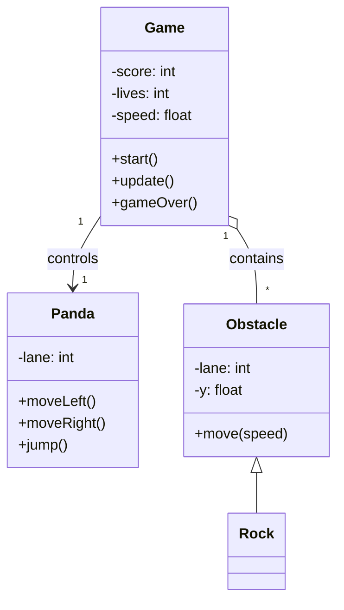

# Class Diagram: Panda Bamboo Jump

Shows the blueprints (classes), their data and actions, and how they connect.

```mermaid
classDiagram
  class Game {
    -score: int
    -lives: int
    -speed: float
    +start()
    +update()
    +gameOver()
  }
  class Panda {
    -lane: int
    +moveLeft()
    +moveRight()
    +jump()
  }
  class Obstacle {
    -lane: int
    -y: float
    +move(speed)
  }
  class Rock
  Game "1" --> "1" Panda : controls
  Game "1" o-- "*" Obstacle : contains
  Obstacle <|-- Rock
```
