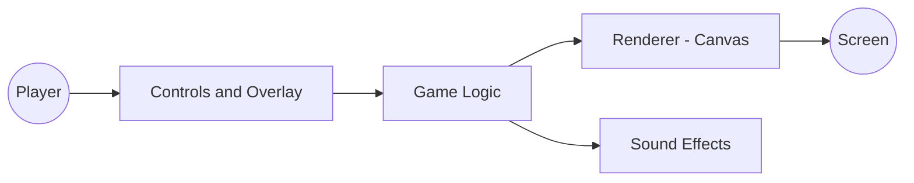

# Component Diagram: Panda Bamboo Jump

Shows the main parts of the system and how they depend on each other.

```mermaid
flowchart LR
  Player((Player)) --> UI[Controls and Overlay]
  UI --> GL[Game Logic]
  GL --> R[Renderer - Canvas]
  GL --> S[Sound Effects]
  R --> Screen((Screen))
```
