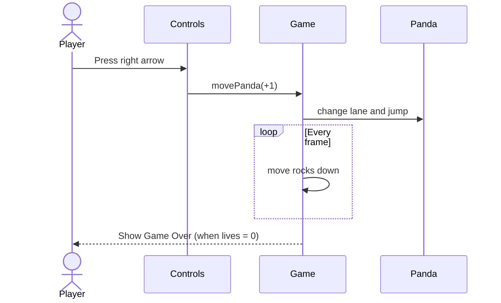

# Sequence Diagram: Panda Bamboo Jump

Shows the order of messages between objects over time.

```mermaid
sequenceDiagram
  actor Player
  participant UI as Controls
  participant Game
  participant Panda
  Player->>UI: Press right arrow
  UI->>Game: movePanda(+1)
  Game->>Panda: change lane and jump
  loop Every frame
    Game->>Game: move rocks down
  end
  Game-->>Player: Show Game Over (when lives = 0)
```
